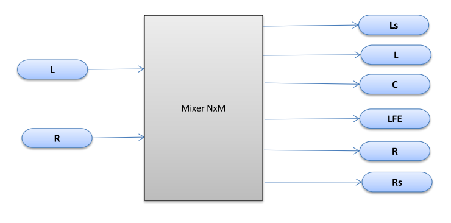
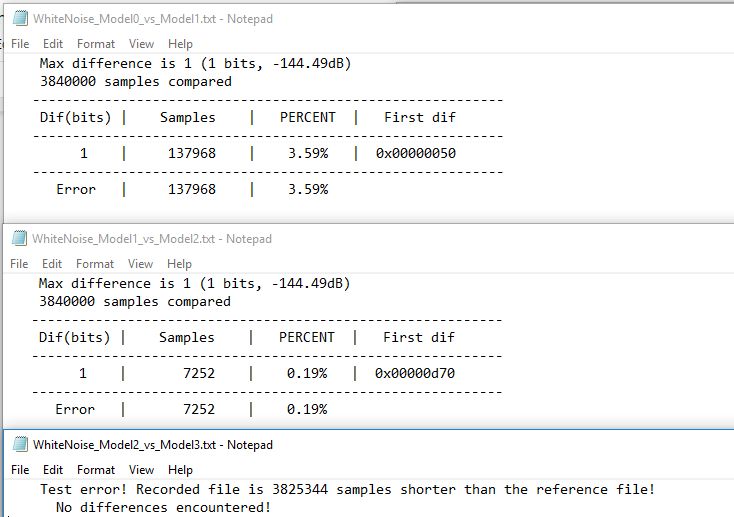

```text
Univerzitet u Novom Sadu
Fakultet tehničkih nauka
Računarska tehnika i računarske komunikacije
```

## Arhitekture i algoritmi DSP 2

### Realizacija algoritma kombinovanja kanala na Cirrus Logic DSP platformi

### Opis 

Projektni zadatak se odnosio na postupak kreiranja modela, koraka koju su potrebni kako bi određeni
algoritam (modul) prilagodili namenskoj platformi. Sistemu na ulaz dovodimo dva signala, stereo zvučni
signal. Obrada se odnosila na kombinovanje kanala i unošenje pojačanja kako bi na izlazu imali dva ili više
signala/kanala u zavisnosti od izlaznog parametra.



Bilo je potrebno proći kroz četiri koraka. Prvi korak (model nula), se kreira na osnovu implementiranog
algoritma bez optimizacija i računa o potrošnji memorije i koristi se kao referentni model. Model jedan,
sledeći korak uvodi funkcionalne optimizacije na nivou C koda. Model dva se prilagođava aritmetici
namenskog procesora. Tek se modelom tri program prevodi kompajlerom za ciljanu platformu gde je
potrebno uraditi optimizacije na niskom nivou kako bi prevodilac uradio što bolji posao.

Ispitivanje i verifikacija može da se uradi na nekoliko načina, pregledom spektralne analize, upotrebom
alata za poređenje odbiraka (PCM compare) i slušanjem dobijenog signala, što je naravno najnepozdanija
metoda.

### Realizacija

Realizacija korak po korak po modulima:

1. Model 0
    * Pisanje referentnog koda
    * Vodimo računa o kvalitetu izlaznog fajla

2. Model 1
    * Izmeštamo strukturu stanja i konstante da budu globalne
    * Smanjujemo broj argumenata funkcije
mixerNxM(ulaznaMatrica, izlaznaMatrica)
    * Umesto indeksiranja uvodimo pristup preko pokazivača
    * Uvodimo DSP tipove
DSPint → int, DSPfrac → float

3. Model 2
    * Prelazimo na emulacione klase
DSPfract → fract
    * Ne korisitmo memset za inicijalizaciju
    * Koristimo FRACT_NUM direktivu

4. Model 3
    * Podacima pridružujemo kvalifikatore memorijskih zona
    * Optimizacija uslovnih grananja oduzimanjem, provera da li su for petlje prevedene u
hardverske
    * Korisitmo asembler kako bi ubrzali određene funkcije

5. Simulator
    * Korigujemo kod da koristi podršku frameworka
    * Kreiramo MCV tabelu

### Ispitivanje

Verifikacija se odnosi na poređenje izlaza za svaka dva susedna modula upotrebom PCM compare
programa.

```
"mixerNxM_model0.exe" "TestStreams/WhiteNoise.wav" "OutStream/WhiteNoise_model0_out.wav"

"PCMCompare.exe" "OutStream//WhiteNoise_model0_out.wav" "OutStream//WhiteNoise_model1_out.wav" 2>
"OutCmp//WhiteNoise_Model0_vs_Model1.txt"
```



Postoji razlika između modela nula i modela jedan zbog klipovanja signala, signal sa jednog kanala
pojačavamo i sabiramo ga sa izlazom, to radimo i sa drugim kanalom. Zato je porebno da radimo
klipovanje kako nebi izlazili van opsega.
